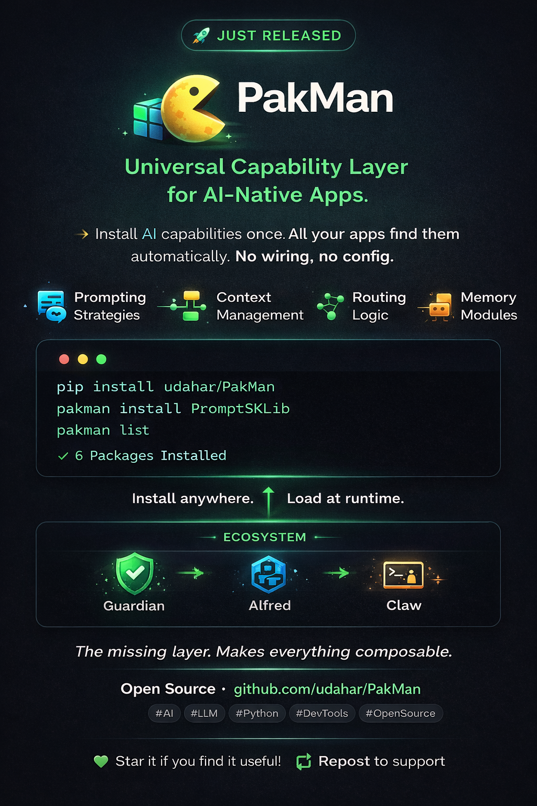

# Forge 📦

**Package manager for AI-native capabilities**

Install a capability once. Every AI app on your machine gains it automatically.

No wiring. No config. Just restart the app.




---

## ⚡ What Forge Is

Forge is a local-first package manager designed specifically for AI systems.

It installs **capabilities** — not libraries.

* Prompting strategies
* Context management
* Routing logic
* Memory modules
* Evaluation tools

Once installed, any Forge-aware app can discover and use them instantly.

---

## 🔥 Why It Matters

Today:

* Every AI app ships its own features
* Nothing composes cleanly
* Everything is duplicated

Forge fixes that.

> Install once → reuse everywhere

It turns AI tools into a **modular ecosystem instead of isolated apps**.

---

## 🚀 Quick Start

```bash
pip install git+https://github.com/udahar/Forge.git

forge install PromptSKLib
forge install context_distiller
forge list
```

---

## 🧠 How It Works

Forge installs packages into:

```
~/.forge/
  packages/
  forge.db
  hashes/
```

Then Forge-aware apps call `hotload()` on startup:

```
forge install PromptSKLib
        ↓
~/.forge/packages/PromptSKLib/
        ↓
App restarts
        ↓
Capability is automatically available
```

No imports. No config. No glue code.

---

🧩 System Diagram

           ┌──────────────────────────────┐
           │        Forge CLI                        │
           │  (install / update / remove)            │
           └─────────────┬────────────────┘
                         │
                         ▼
                ┌─────────────────┐
                │ ~/.forge/             │
                │ packages/             │
                │ forge.db              │
                │ hashes/               │
                └───────┬─────────┘
                        │
        ┌───────────────┼──────────────────┐
        │               │                  │
        ▼               ▼                  ▼
 ┌────────────┐  ┌────────────┐   ┌────────────┐
 │   App A         │  │   App B        │   │   App C        │
 │ (Claw)          │  │ (Alfred)       │   │ (Other)        │
 └─────┬──────┘  └─────┬──────┘   └─────┬──────┘
       │               │                │
       ▼               ▼                ▼
     hotload()      hotload()       hotload()
       │               │                │
       └───────┬───────┴────────────┬───┘
               ▼                    ▼
        ┌───────────────┐   ┌───────────────┐
        │ Installed           │   │ Installed           │
        │ Packages            │   │ Capabilities        │
        │ (PromptSKLib)       │   │ (Routing, etc)      │
        └───────────────┘   └───────────────┘

🔄 Flow

forge install PromptSKLib
        ↓
~/.forge/packages/PromptSKLib/
        ↓
App restarts
        ↓
hotload() scans packages
        ↓
Capability is available instantly

No imports. No config. No glue code.


## 🧩 Core Features

### 📦 Capability Packages

* Drop-in functionality for AI apps
* Zero manual integration

### ⚡ Sparse Installs

* Uses git sparse-checkout
* Downloads only what’s needed

### 🔁 Auto Discovery

* Apps scan installed packages at startup
* Capabilities load automatically

### 🔐 Security Model

* Trusted registry (udahar only)
* SHA256 integrity checks
* Explicit opt-in for community packages

### 🧪 Health System

```bash
forge health
```

Detects broken packages and missing dependencies before runtime

---

## 🛠 CLI Overview

```bash
# Install
forge install PromptSKLib
forge install ./local_package

# Update
forge update

# Remove
forge remove PromptSKLib

# Search
forge search prompt

# Inspect
forge info PromptSKLib

# Health check
forge health
```

---

## 🔥 Example Flow

```
forge install cost_optimizer
        ↓
Restart your AI app
        ↓
Routing logic now available
```

No code changes required.

---

## 🧱 Package Structure

```
my_package/
├── __init__.py
├── README.md
└── requirements.txt
```

Install locally:

```bash
forge install ./my_package
```

---

## 📦 Package Catalog

**87 packages across 27 categories.** See [PACKAGES.md](PACKAGES.md) for the full index.

Highlights:

| Category | Packages |
|----------|----------|
| Agents | AgentBazaar, ApprovalGate, Council, SwarmProtocol |
| Context | ContextCompressor, ContextDistiller, GraphMemory, SemanticCache |
| Evaluation | EvalFramework, BenchmarkArena, GapMan, RedTeamer |
| ML | LoRA, MLStack, AutoDistiller, FeedbackLoop, AnomalyEngine |
| NLP | NLPPipeline, NERExtractor, DocumentShredder |
| Prompting | PromptSKLib, PromptForge, PromptOS, PromptRouter |
| Safety | SafetySentry, ApprovalGate, RedTeamer |
| Skills | SkillsFramework, SkillComposer, SkillsRegistry, SkillEvolver |

---

## 🌐 Ecosystem

Forge is part of a larger AI-native stack:

* **Alfred** → orchestration + execution
* **Claw** → agent runtime
* **Benchmark** → model scoring + ranking
* **FieldBench** → multi-agent coordination

Forge → the capability layer that connects everything

---

## 🧨 Philosophy

Forge is built on one idea:

> AI tools should be composable, not monolithic.

This is the raw building blocks for your own AI stack — no cloud lock-in, no monolith.
Install what you need. Everything else stays out of the way.

---

## 📜 License

MIT
